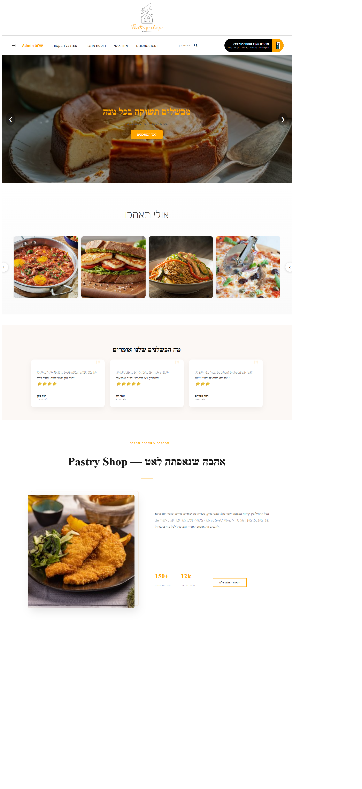
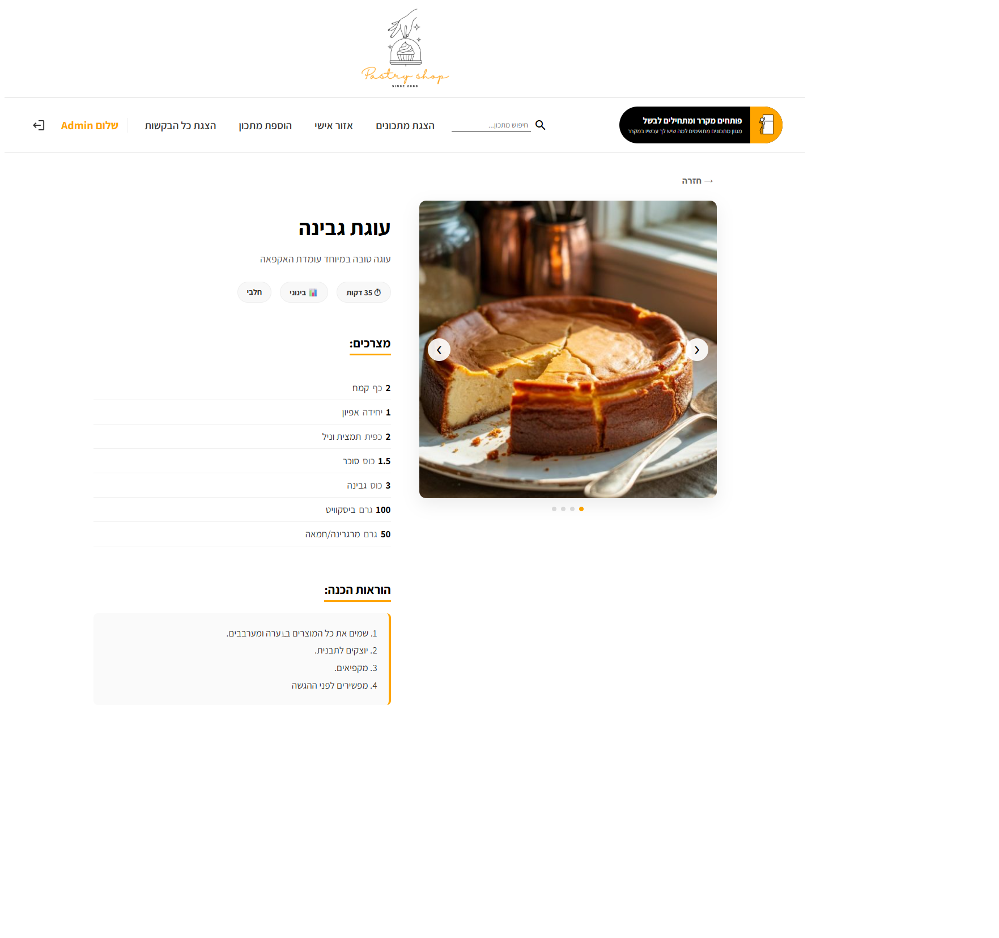
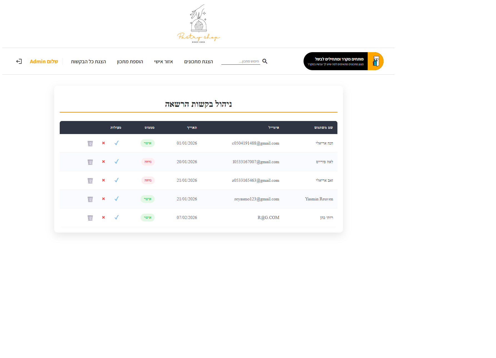
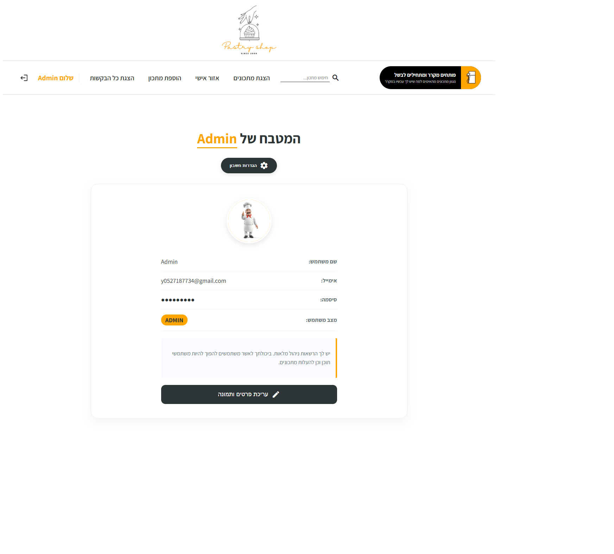
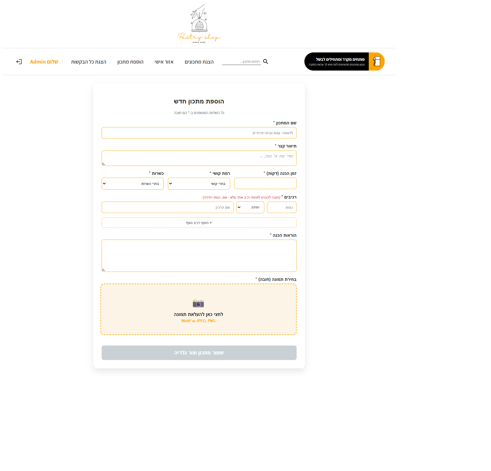
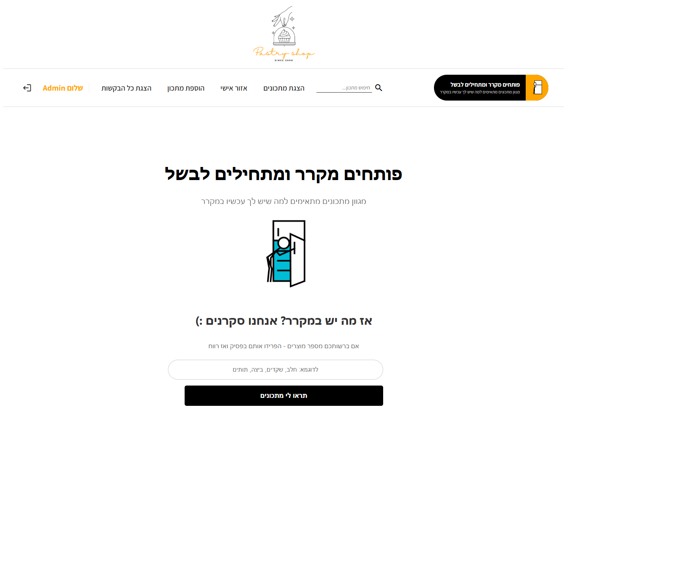
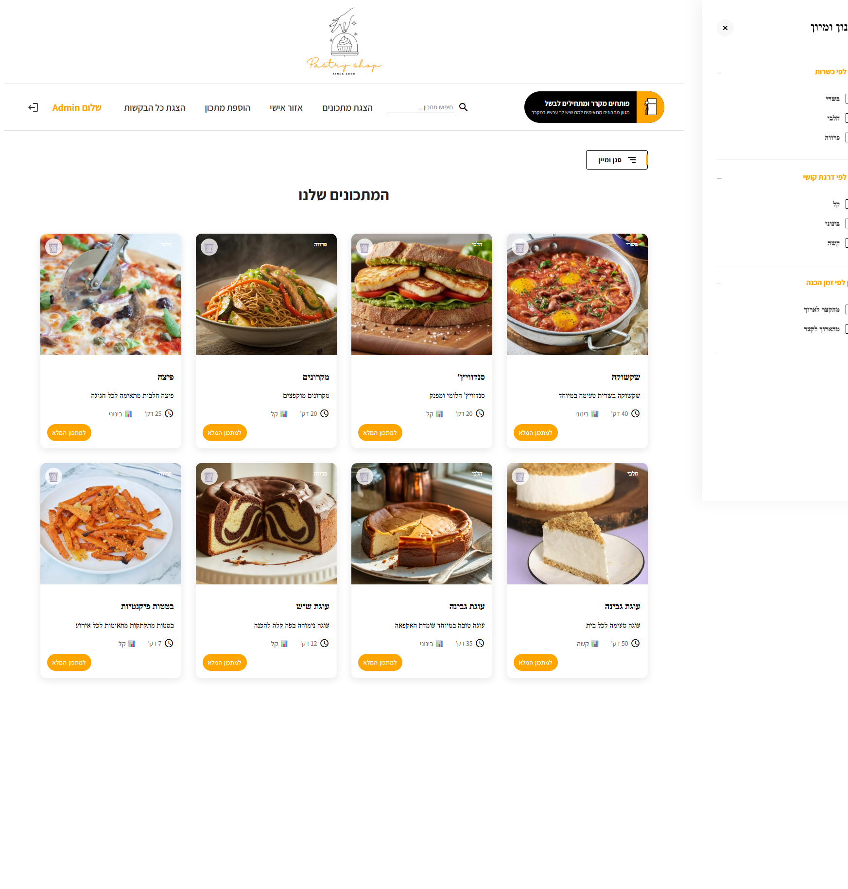
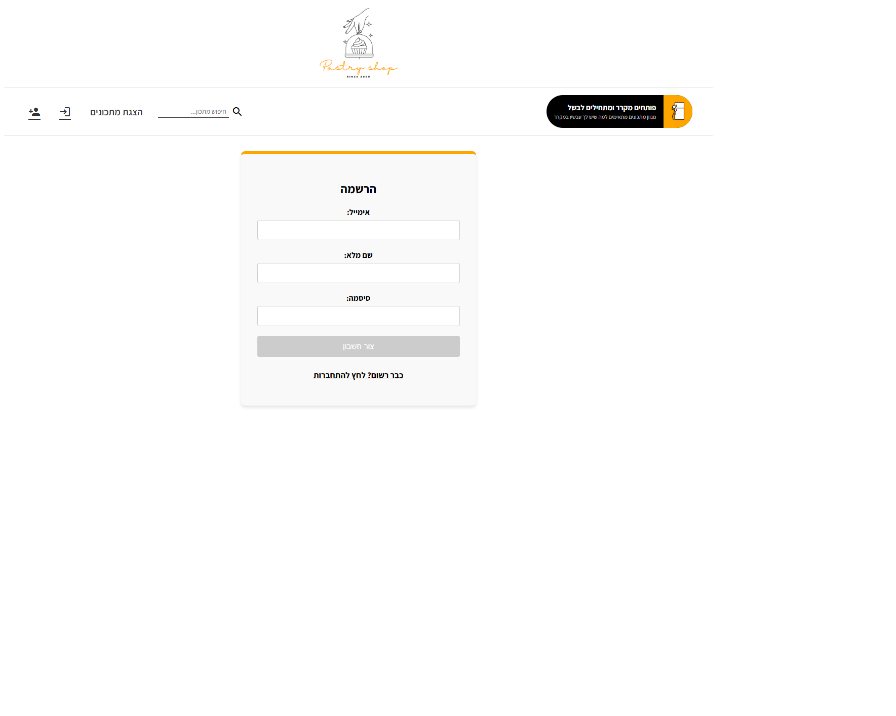

# Recipe Sharing Platform 🍳

A full-stack recipe platform featuring user authentication, admin management, and advanced search capabilities.

[🎥 Watch the 30s Demo](PUT_YOUR_VIDEO_LINK_HERE)

---

## ✨ Core Features
* 🔐 **Authentication:** Secure login & signup using JWT
* 👩‍🍳 **Recipe Management:** Create, edit, and delete recipes (full CRUD)
* 🔍 **Advanced Search:** Filter recipes by ingredients and categories
* 🛠️ **Admin Dashboard:** Manage users and content efficiently
* 🖼️ **Image Handling:** Upload and process recipe images

---

## 🛠️ Tech Stack
* **Frontend:** Angular (TypeScript, HTML, CSS)
* **Backend:** Python, Flask (REST API)
* **Database:** MySQL with SQLAlchemy ORM
* **Authentication:** JWT (Flask-JWT-Extended)

---

## 🏗️ Architecture
Monorepo structure containing:
* `/client` – Angular frontend
* `/server` – Flask backend API

---

## 📸 Visual Preview










---

## 🚀 Quick Setup

### Backend
```bash
cd server
python -m venv venv
venv\Scripts\activate
pip install -r requirements.txt
python app.py
```

### Frontend
```bash
cd client
npm install
ng serve
```
